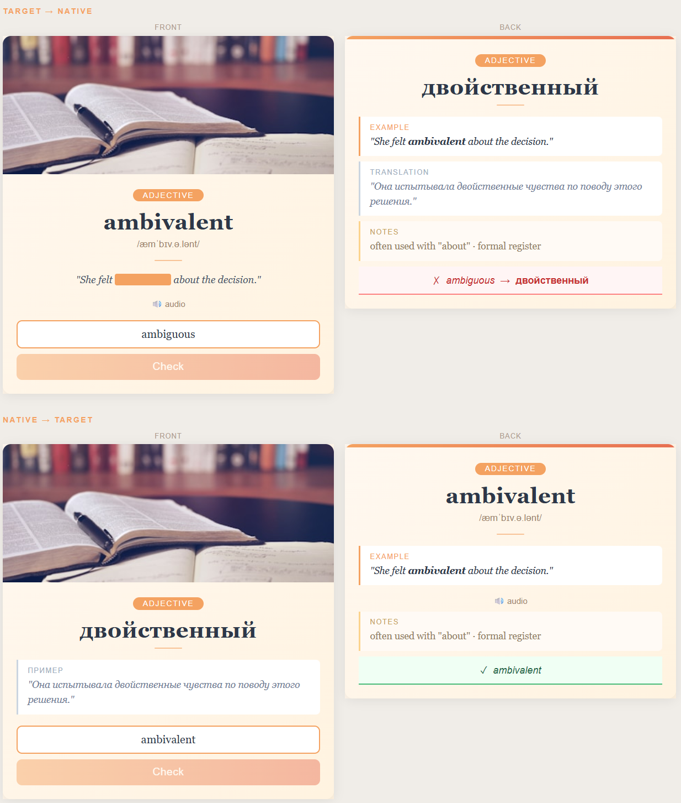

# Language Card — Anki Template

**Language / Мова / Язык:** 🇬🇧 English &nbsp;·&nbsp; [🇺🇦 Українська](README.ua.md) &nbsp;·&nbsp; [🇺🇦 Русский](README.ru.md)

---

A bilingual Anki note type for learning vocabulary: words, collocations, and phrases. One note generates two cards — **Target → Native** (receptive) and **Native → Target** (productive). Works with any language pair.



## Quick start

Download [`language-card-sample.apkg`](language-card-sample.apkg) and import it into Anki (**File → Import**). The note type with all fields and templates, plus a sample card, will be added automatically.

To set up manually from source instead, follow the [Setup](#setup) section below.

## Features

- Warm, friendly design — works on iPhone (AnkiMobile), iPad, and desktop Anki
- Two card directions from a single note entry
- Tap-to-reveal cloze on example sentences — write `[word]` in the example field
- Optional fields: image, audio, transcription, notes — hidden when empty
- Night mode support

## Fields

| Field | Required | Description |
|-------|----------|-------------|
| `Word` | ✓ | Target language word, collocation, or phrase |
| `Translation` | ✓ | Native language translation |
| `PartOfSpeech` | ✓ | e.g. `noun`, `verb`, `adjective`, `phrase`, `collocation` |
| `Transcription` | — | IPA transcription, e.g. `æmˈbɪv.ə.lənt` |
| `ExampleTarget` | ✓ | Example sentence. Wrap the key word in `[brackets]` for cloze reveal |
| `ExampleNative` | ✓ | Translation of the example sentence |
| `Audio` | — | Audio file, e.g. `[sound:word.mp3]` |
| `Image` | — | Image added via Anki media |
| `Notes` | — | Usage notes: register, typical collocations, common mistakes |

### Cloze syntax

Write the example with the key word or phrase in square brackets:

```
She felt [ambivalent] about the decision.
```

On the **front** of Target → Native, the word appears as a tappable orange block. Tap it — the word reveals. On the **back**, it is shown in bold.

## Setup

### 1. Create a new Note Type

Open Anki → **Tools → Manage Note Types → Add**

Choose **"Add: Basic"** as the starting point. Name it `Language Card`.

### 2. Add fields

Click **Fields**. Rename the default fields and add the rest in this exact order:

1. `Word`
2. `Translation`
3. `PartOfSpeech`
4. `Transcription`
5. `ExampleTarget`
6. `ExampleNative`
7. `Audio`
8. `Image`
9. `Notes`

Click **Save**.

### 3. Paste the CSS

Click **Cards → Styling**. Delete the default content and paste the entire contents of [`src/style.css`](src/style.css).

### 4. Set up Card 1 — Target → Native

Make sure **Card 1** is selected.

- **Front Template** — delete everything, paste [`src/front-target-native.html`](src/front-target-native.html)
- **Back Template** — delete everything, paste [`src/back-target-native.html`](src/back-target-native.html)
- Rename: **Options → Rename Card Type** → `Target → Native`

### 5. Add Card 2 — Native → Target

Click **Add Card Type**.

- **Front Template** — delete everything, paste [`src/front-native-target.html`](src/front-native-target.html)
- **Back Template** — delete everything, paste [`src/back-native-target.html`](src/back-native-target.html)
- Rename: **Options → Rename Card Type** → `Native → Target`

Click **Save / Close**.

### 6. Test with a sample note

Add a new note using the `Language Card` note type:

| Field | Value |
|-------|-------|
| Word | `ambivalent` |
| Translation | `двойственный` |
| PartOfSpeech | `adjective` |
| Transcription | `æmˈbɪv.ə.lənt` |
| ExampleTarget | `She felt [ambivalent] about the decision.` |
| ExampleNative | `Она испытывала двойственные чувства по поводу этого решения.` |
| Notes | `often used with "about" · formal register` |

Preview both generated cards. Tap the orange block in the example — the word should reveal.

## Project structure

```
anki-card-template/
├── src/
│   ├── style.css                  # Shared CSS → paste into Anki Styling section
│   ├── front-target-native.html   # Card 1 front template
│   ├── back-target-native.html    # Card 1 back template
│   ├── front-native-target.html   # Card 2 front template
│   └── back-native-target.html    # Card 2 back template
└── preview/
    └── index.html                 # Visual preview — open in any browser
```
